Hi, I'm Sahal Imran 👋

Full-Stack Developer & AI Solutions Expert

Building scalable products that solve real business problems.

I design and develop production-ready web apps, mobile apps, SaaS platforms, APIs, and AI-powered systems for startups and growing businesses.

  
  
  

👨‍💻 About Me

I'm a Full-Stack Developer and AI Solutions Expert with 5+ years of experience building scalable, user-focused digital products from concept to deployment.

My work combines frontend engineering, backend architecture, databases, cloud infrastructure, mobile development, and applied AI. I focus on clean architecture, performance, maintainability, and real-world usability.

🚀 Build SaaS, IaaS, MVPs, dashboards, marketplaces, PWAs, and custom business systems

⚙️ Design REST APIs, authentication/authorization, RBAC, webhooks, caching, and third-party integrations

🤖 Build AI chatbots, RAG systems, AI automation workflows, and OpenAI-powered features

📱 Develop cross-platform mobile applications and backend-integrated experiences

☁️ Work across cloud, serverless, database, and deployment infrastructure

🤝 Experienced working with founders, startups, product teams, and international clients

🛠️ Tech Stack

Languages

  

Frontend & Mobile

  

React · Next.js · Vue · React Native · Flutter · Tailwind CSS · shadcn/ui · React Query · Zod

Backend & APIs

  

Node.js · Express.js · Django · FastAPI · .NET · REST APIs · JWT · RBAC · Webhooks · API Integrations

Databases & Cloud

  

PostgreSQL · MongoDB · MySQL · Supabase · Firebase · Redis · AWS · Azure · Vercel · Docker

AI & Automation

AI Chatbots · OpenAI API · RAG Systems · AI Automation · Prompt Engineering · Speech AI · Intelligent Workflows

Engineering Tools

  

Git · GitHub · GitLab · GitHub Actions · CI/CD · Postman · Swagger · System Design

💼 Experience

Role

Company

Period

Full Stack & AI Developer

Fiverr / Upwork

2020 — Present

Personal Assistant — Product & Development

Living3D

Apr 2025 — Dec 2025

Product Designer & Developer

Astrascribe

Jan 2025 — Mar 2025

Full Stack Developer

Secomind (StudioX)

Oct 2023 — Feb 2024

Full Stack Developer

Biokript

Nov 2021 — Feb 2024

🚀 Selected Projects

Project

What I Built

Astrascribe

EMR, AI Scribe, and hospital management platform

Builder Bid Book

Platform connecting builders with contracts

Twendi

Athlete discovery and profile platform

TieBreak10

Tennis tournament management system

Aabroowear

E-commerce clothing store

I Love Massages

UK massage therapist directory

More work and case studies are available on sahalimran.com.

🔨 What I Build

Area

Focus

Full-Stack Web Development

End-to-end applications with scalable architecture and modern frontend systems

Android / iOS Development

Cross-platform mobile applications with backend and API integration

Backend & API Systems

Secure APIs, authentication, integrations, and structured data flows

AI Integration & Automation

AI-powered features, chatbots, RAG, automation, and intelligent workflows

SaaS / IaaS / MVP Development

Product architecture, role-based systems, cloud infrastructure, and rapid delivery

Maintenance & Optimization

Performance improvements, upgrades, debugging, and system optimization

📊 GitHub Stats

  
  

  GitHub language statistics are based on public repository code and do not represent overall technical proficiency.

🎓 Education

Bachelor of Science in Computer Science
University of Engineering & Technology, Taxila · 2020 — 2024

🤝 Let's Build Something

I'm available for full-stack development, AI integrations, SaaS/MVP development, mobile apps, backend systems, and long-term product collaboration.

  <a href="https://www.sahalimran.com/">Portfolio</a>
  &nbsp;•&nbsp;
  <a href="https://www.linkedin.com/in/sahal-imran-511b24203/">LinkedIn</a>
  &nbsp;•&nbsp;
  <a href="mailto:sahalimran7866@gmail.com">Email</a>
  &nbsp;•&nbsp;
  <a href="https://github.com/sahal-imran">GitHub</a>

Building products that scale.

